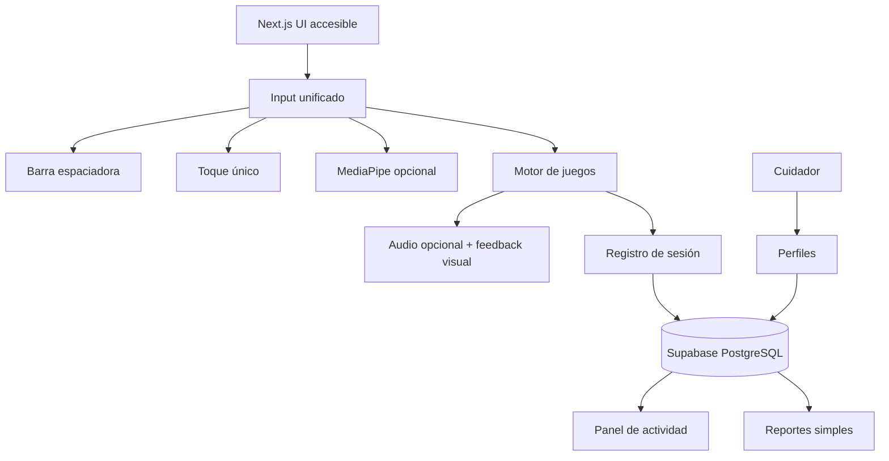

# Hacktoon Kiro

Plataforma web de juegos accesibles para personas adultas mayores de 70–80 años, incluyendo usuarios con movilidad muy reducida. El proyecto prioriza una interacción simple, pausada y no clínica, con soporte para computadora, móvil/tablet y cámara opcional.

## Qué vamos a hacer

Construiremos una plataforma de juegos accesibles que permita:

- Jugar con una sola entrada: barra espaciadora, un toque o una mano opcional.
- Usar el sistema en computadoras, móviles y tablets.
- Compartir un dispositivo mediante perfiles seleccionables por nombre y avatar.
- Permitir que un cuidador cree y gestione los perfiles.
- Ofrecer juegos sin combinaciones de teclas, arrastre, doble toque obligatorio, movimientos rápidos ni precisión fina.
- Incluir pausa, reanudación, reinicio y práctica sin penalización.
- Proporcionar instrucciones breves, visuales y repetibles.
- Mantener el audio como opción complementaria, siempre con una alternativa visual.
- Registrar únicamente datos mínimos de actividad: nombre, sesiones, juegos utilizados y tiempo de juego.
- Mostrar al cuidador información de actividad, nunca diagnósticos ni conclusiones médicas.

La cámara será opcional. Cuando se active, MediaPipe se ejecutará en el cliente y no se almacenará ni enviará video al servidor.

## Qué estamos haciendo ahora

La base de accesibilidad, los perfiles, la entrada unificada y el motor de asistencia ya están implementados. Hay tres actividades disponibles: **Carrera de sacos**, **Lanzamiento del trompo** y **El Jardín Virtual**.

### Ya está implementado

- Proyecto Next.js con TypeScript y App Router.
- Tailwind CSS configurado mediante PostCSS.
- ESLint y configuración de compilación.
- Página inicial accesible en español.
- Perfiles locales de demostración y preparación para Supabase con RLS.
- Entrada unificada por barra espaciadora, toque y mano simulada.
- Motor de estados con pausa, reanudación, reinicio, asistencia y práctica sin penalización.
- Carrera de sacos con avance automático, salto por una acción y ventana amplia.
- Lanzamiento del trompo con marca móvil, lanzamiento por una acción y ventana amplia.
- El Jardín Virtual con escenas lentas, cuidado por una acción y sin derrota.
- Protección contra repeticiones de una pulsación larga.
- Feedback visual con `aria-live`.
- Foco visible para teclado.
- Tokens visuales para fondo cálido, contraste, estados, bordes y foco.
- Soporte para `prefers-reduced-motion` y zoom del navegador.
- Texto que deja claro que el producto es no clínico.
- Repositorio Git inicializado y publicado en GitHub.

### Validaciones realizadas

- `npm install`
- `npm run lint`
- `npm run build`
- Smoke test HTTP de la página inicial y de las tres actividades.
- Verificación de que `node_modules` y `.next` no se incluyan en Git.

## Plan de implementación

El desarrollo se realizará paso a paso, manteniendo el alcance controlado:

1. **Proyecto base y sistema visual accesible** — completado.
2. **Perfiles y Supabase** — autenticación del cuidador, jugadores y selección en dispositivos compartidos.
3. **Entrada unificada** — teclado, toque y mano como eventos lógicos independientes.
4. **Motor de acciones y asistencia** — estados, pausas, ritmo configurable y errores sin penalización.
5. **Carrera de sacos** — avance automático, salto por una acción y ventana amplia.
6. **Lanzamiento del trompo** — lanzamiento por una acción con ventana amplia y práctica sin penalización.
7. **Director de Orquesta** — secuencias musicales con feedback visual y sonoro opcional.
8. **El Jardín Virtual** — completado: experiencia relajante sin puntuación ni derrota.
9. **Audio opcional** — música, efectos y narración con equivalentes visuales.
10. **Sesiones y datos mínimos** — registro al inicio y final de cada sesión.
11. **Panel de cuidador** — actividad reciente, tiempo de juego y juegos realizados.
12. **Alertas no clínicas** — avisos de actividad sin interpretaciones médicas.
13. **Accesibilidad multiplataforma** — escritorio, móvil, tablet, zoom y teclado.
14. **Validación con usuarios y revisión legal** — pruebas con personas de 70–80 años y revisión de normativa ecuatoriana.
15. **Optimización para planes gratuitos** — Vercel Free, Supabase Free y procesamiento local de cámara.

El desglose detallado de cada etapa está en [`TASK.md`](./TASK.md).

## Arquitectura prevista



### Tecnologías

- **Frontend:** Next.js, React, TypeScript y Tailwind CSS.
- **Aplicación:** App Router.
- **Base de datos y autenticación:** Supabase.
- **Despliegue:** Vercel Free.
- **Cámara opcional:** MediaPipe ejecutado localmente en el navegador.
- **Assets:** carpeta `public/` y CDN de Vercel.
- **Reportes:** datos agregados y PDFs generados del lado del cliente, si se mantienen.

## Accesibilidad y privacidad

La plataforma se diseñará tomando como referencia WCAG 2.2, WAI-AGE, Game Accessibility Guidelines, Ability-Based Design e ISO 9241-171.

Principios principales:

- Objetivos táctiles preferidos de al menos 44 × 44 CSS px.
- Contraste, foco visible, semántica HTML y navegación por teclado.
- No depender exclusivamente de color, audio o animación.
- Animaciones lentas, pausables y compatibles con reducción de movimiento.
- Tiempos, velocidades y tamaños configurables y validados con usuarios reales.
- No almacenar video, imágenes de cámara ni datos biométricos derivados.
- No recopilar ni mostrar diagnósticos, deterioro o rendimiento médico.
- Revisar la normativa ecuatoriana aplicable usando fuentes oficiales antes de presentar el sistema como producto.

## Resultado esperado

Al finalizar el MVP, un cuidador podrá crear perfiles y varios jugadores podrán compartir un dispositivo. Cada jugador podrá seleccionar su nombre o avatar y completar cuatro juegos usando únicamente la barra espaciadora en computadora o un toque en móvil/tablet.

El MVP final deberá ofrecer:

- Cuatro juegos accesibles con una sola pulsación.
- Cámara opcional y procesamiento local.
- Audio opcional con equivalente visual para cada evento.
- Pausa, reanudación, reinicio y práctica sin penalizaciones.
- Sesiones, juegos y tiempo de juego registrados con datos mínimos.
- Panel de actividad para el cuidador con lenguaje no clínico.
- Pruebas de accesibilidad automatizadas, manuales y con personas de 70–80 años.
- Verificación de la normativa ecuatoriana aplicable.
- Despliegue funcional dentro del consumo esperado de Vercel Free y Supabase Free.

## Alcance y límites

Este proyecto es una plataforma de entretenimiento y actividad accesible. **No es un dispositivo médico, no realiza diagnósticos y no sustituye la evaluación de profesionales de la salud.**

Los valores de tiempo de reacción, velocidad de escaneo, precisión de MediaPipe, tamaño de hitboxes y frecuencia sonora no se considerarán universales: serán configurables y se validarán con usuarios reales.

## Desarrollo local

Instala las dependencias y ejecuta el servidor de desarrollo:

```powershell
npm install
npm run dev
```

Abre [http://localhost:3000](http://localhost:3000) en el navegador.

Comandos de validación:

```powershell
npm run lint
npm run build
```

## Repositorio

El proyecto se publica en [github.com/HectorZL/hacktoonkiro](https://github.com/HectorZL/hacktoonkiro).
