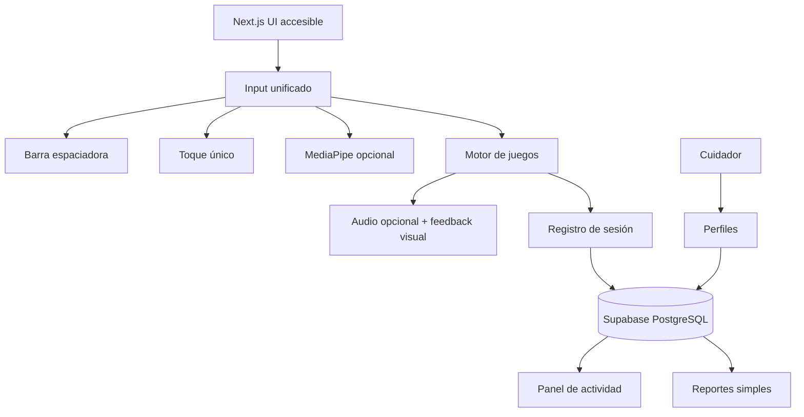

# Plan de implementación — Plataforma de juegos accesibles para adultos mayores

## Problema

Crear una plataforma web para personas de 70–80 años, incluyendo usuarios con movilidad muy reducida. El sistema debe permitir jugar con:

- **Computadora:** barra espaciadora como entrada predeterminada.
- **Móvil/tablet:** un toque como entrada predeterminada.
- **Cámara:** reconocimiento opcional de una mano.
- **Dispositivos compartidos:** selección de perfil por nombre/avatar.
- **Gestión:** el cuidador crea los perfiles.
- **Datos:** solo nombre, sesiones, juegos utilizados y tiempo de juego.
- **Resultados:** indicadores de actividad y bienestar, nunca diagnósticos médicos.
- **Audio:** opcional, siempre con equivalente visual.
- **Despliegue:** Next.js en Vercel Free + Supabase Free.

No se almacenará video de la cámara.

## Requisitos consolidados

### Accesibilidad

1. Todos los juegos deben poder completarse con una sola entrada:
   - barra espaciadora;
   - un toque;
   - o una mano, como alternativa opcional.
2. No se requerirán:
   - combinaciones de teclas;
   - pulsaciones simultáneas;
   - mantener una tecla presionada;
   - arrastrar;
   - doble toque obligatorio;
   - movimientos rápidos;
   - precisión fina.
3. Cada juego tendrá una mecánica adaptada:
   - una pulsación puede confirmar una acción;
   - activar una acción automática;
   - avanzar un paso;
   - o interactuar con el elemento actual.
4. Las pulsaciones accidentales deben tener protección contra rebote y recuperación.
5. Debe existir pausa, reanudación, reinicio y práctica sin penalización.
6. Las instrucciones serán breves, visuales y repetibles.
7. El audio nunca será la única forma de comunicar información.
8. Los objetivos táctiles preferidos serán de al menos **44 × 44 CSS px**. WCAG 2.2 establece 24 × 24 px como mínimo AA en el criterio correspondiente; 44 × 44 será una decisión protectora para este público.
9. Se aplicarán WCAG 2.2 en contraste, teclado, foco, tamaño de texto, alternativas a gestos, tiempo y cancelación de acciones.
10. La conformidad final debe comprobarse también con usuarios reales de 70–80 años.

### Mecánicas accesibles

Los cuatro juegos utilizarán una interacción por turnos o acción automática lenta:

1. El sistema muestra una situación.
2. El usuario pulsa espacio o toca una vez.
3. El sistema ejecuta una acción.
4. Se muestra una confirmación visual.
5. La siguiente acción aparece sin penalizar errores.

La duración y la complejidad serán ajustables por juego.

## Investigación utilizada

### Evidencia directa

- **W3C WCAG 2.2:** teclado, foco, contraste, tamaño de objetivos, gestos, cancelación, límites de tiempo y alternativas no sonoras.
- **W3C WAI-AGE:** necesidades relacionadas con envejecimiento visual, auditivo, cognitivo y motriz.
- **Game Accessibility Guidelines:** controles simples, alternativas digitales a gestos, ausencia de acciones simultáneas, velocidad ajustable, prácticas sin fallo y compatibilidad con tecnologías asistivas.
- **Ability-Based Design**, Wobbrock et al., DOI: 10.1145/1941487.1941504.
- **ISO 9241-171:** orientación sobre accesibilidad de software.
- **NN/g:** investigación de usabilidad con usuarios mayores de 65 años.

### Decisiones que deberán validarse

No existe evidencia universal que determine una ventana de reacción exacta, una tasa mínima de acierto de MediaPipe o una frecuencia sonora ideal para todos los adultos mayores. Por ello, valores como el tiempo inicial de respuesta, velocidad de escaneo y tamaño de hitboxes serán configurables y se probarán con usuarios.

### Ecuador

Durante la fase legal se deberá verificar oficialmente:

- Constitución del Ecuador, especialmente derechos de grupos de atención prioritaria.
- Ley Orgánica de las Personas Adultas Mayores.
- Ley Orgánica de Discapacidades, si corresponde al grupo o servicio.
- Ley Orgánica de Protección de Datos Personales.
- Vigencia y alcance de NTE INEN-ISO/IEC 40500:2012.
- Requisitos oficiales del Registro Oficial y del INEN.

La aplicación no se presentará como dispositivo médico ni como herramienta diagnóstica.

## Arquitectura propuesta



## Principios técnicos

- MediaPipe solo se carga si el jugador selecciona cámara.
- No se procesa ni almacena video en el servidor.
- La barra espaciadora funciona como entrada predeterminada en computadora.
- El toque único funciona como entrada predeterminada en móvil/tablet.
- Las métricas se guardan al iniciar y terminar una sesión, no en cada frame.
- Los reportes y gráficas se generan con datos mínimos.
- Se evita Realtime salvo que sea necesario, para respetar el plan gratuito.
- Los assets se sirven desde `public/` y la CDN de Vercel.
- Los PDFs, si se mantienen, se generan del lado del cliente.

## Task Breakdown

### Task 1: Crear el proyecto base y el sistema visual accesible

**Objetivo:** Crear el proyecto Next.js con TypeScript, App Router, Tailwind y tokens visuales accesibles.

**Implementación:**

- Crear el proyecto con Next.js y TypeScript.
- Configurar Tailwind y estilos globales.
- Crear tokens para:
  - fondo cálido de bajo deslumbramiento;
  - texto oscuro de alto contraste;
  - estados de éxito, advertencia y error redundantes por color, icono y texto;
  - tipografía legible;
  - botones de mínimo 48 px preferidos;
  - foco visible.
- Usar `button`, `label`, `main`, `nav` y otros elementos semánticos.
- Evitar fijar colores como requisito científico; validar contraste con herramientas WCAG.

**Tests:**

- Prueba automatizada de contraste.
- Navegación por teclado.
- Verificación de foco visible.
- Prueba de zoom al 200%.

**Demo:** Página inicial accesible con un botón grande que puede activarse con teclado y toque.

### Task 2: Configurar Supabase y perfiles creados por cuidadores

**Objetivo:** Permitir que un cuidador cree y seleccione perfiles de jugadores en dispositivos compartidos.

**Implementación:**

- Configurar Supabase Auth para cuidadores.
- Crear tablas:
  - `profiles`;
  - `caregiver_players`;
  - `player_settings`.
- El cuidador podrá crear un jugador con:
  - nombre;
  - avatar opcional;
  - configuración de entrada;
  - nivel de asistencia.
- Crear pantalla de selección de jugador con nombres y avatares grandes.
- Configurar RLS:
  - el cuidador solo ve sus jugadores;
  - un jugador no puede ver datos de otros;
  - no guardar información clínica.
- Permitir cerrar y cambiar de jugador fácilmente.

**Tests:**

- Un cuidador crea un perfil.
- El perfil aparece en la selección.
- Un cuidador no puede ver perfiles ajenos.
- Se puede cambiar de perfil en un dispositivo compartido.

**Demo:** El cuidador crea “María” y “José”; ambos aparecen como perfiles seleccionables.

### Task 3: Implementar el sistema de entrada unificado

**Objetivo:** Unificar barra espaciadora, toque y mano en eventos independientes de la fuente.

**Implementación:**

- Crear una interfaz común:

```ts
type InputMode = "keyboard" | "touch" | "hand";

type GameInput =
  | { type: "action"; timestamp: number }
  | { type: "position"; x: number; y: number; timestamp: number }
  | { type: "pause"; timestamp: number };
```

- `KeyboardAdapter`:
  - espacio = acción;
  - Escape = pausa/salida, si el dispositivo lo permite;
  - no exigir flechas.
- `TouchAdapter`:
  - un toque = acción;
  - botón táctil de pausa separado.
- `HandAdapter`:
  - cargarse solo bajo demanda;
  - gesto de acción configurable;
  - usar posición solo en juegos que realmente lo necesiten.
- Implementar:
  - cooldown para evitar doble activación;
  - tolerancia a pulsaciones largas;
  - indicador visual de entrada aceptada.
- Guardar `keyboard` como modo predeterminado en computadora.

**Tests:**

- Una pulsación genera una única acción.
- Una pulsación larga no genera acciones repetidas.
- Un toque genera una única acción.
- Los tres adapters producen el mismo evento lógico.
- Pausa y reanudación funcionan con el método seleccionado.

**Demo:** Una pantalla muestra “Acción recibida” mediante espacio, toque o mano.

### Task 4: Crear el motor de acciones automáticas y asistencia

**Objetivo:** Permitir que el sistema avance lentamente y que el jugador solo confirme acciones.

**Implementación:**

- Crear una máquina de estados:
  - `idle`;
  - `showing`;
  - `waiting-for-action`;
  - `accepted`;
  - `feedback`;
  - `paused`;
  - `completed`.
- Configurar por juego:
  - duración de cada estado;
  - velocidad de escaneo;
  - número de opciones;
  - tamaño de hitboxes;
  - número de reintentos.
- Añadir niveles:
  - **Básico:** menos asistencia.
  - **Guiado:** opciones más grandes y ritmo reducido.
  - **Asistido:** ritmo lento, orientación visual y errores sin penalización.
- Permitir cambiar el nivel durante una sesión.

**Tests:**

- El flujo no requiere pulsaciones rápidas.
- Pausar conserva el estado.
- Reanudar continúa desde el mismo punto.
- Un error permite repetir.
- La acción automática no se activa sin feedback visual.

**Demo:** Una pantalla presenta una opción, espera la pulsación y muestra una confirmación grande.

### Task 5: Implementar “Carrera de sacos”

**Objetivo:** Crear una carrera lúdica que se controle con una sola pulsación o toque, sin exigir movimientos rápidos.

**Implementación:**

- El personaje avanza automáticamente a ritmo configurable.
- Espacio/toque activa un salto dentro de una ventana amplia.
- Los obstáculos son grandes y se muestran con anticipación.
- Un salto fuera de tiempo sirve como práctica y no elimina al jugador.
- En modo mano, una acción simulada activa el mismo salto.
- Incluir pausa, reanudación, reinicio y feedback visual.

**Tests:**

- La actividad se puede completar solo con espacio.
- La actividad se puede completar solo con toque.
- El juego continúa tras un salto fuera de la ventana.
- La velocidad y la ventana cambian según asistencia.
- La entrada tiene cooldown contra pulsaciones accidentales.

**Demo:** El personaje recorre la pista y supera obstáculos con una pulsación amplia.

### Task 6: Implementar “Lanzamiento del trompo”

**Objetivo:** Crear una actividad de lanzamiento controlada con una sola pulsación o toque y una ventana de acción amplia.

**Implementación:**

- Mostrar una marca que se mueve lentamente entre los extremos de una pista.
- Espacio/toque lanza el trompo cuando la marca está dentro de la ventana verde.
- Un lanzamiento fuera de la ventana inicia una ronda de práctica sin derrota.
- La duración del giro y la amplitud de la ventana se ajustan por asistencia.
- En modo mano, una acción simulada activa el mismo lanzamiento.
- Incluir pausa, reanudación, reinicio y feedback visual.

**Tests:**

- La actividad se puede completar solo con espacio.
- La actividad se puede completar solo con toque.
- Un lanzamiento fuera de la ventana no finaliza la actividad.
- Las ventanas se identifican con texto, forma y posición, no solo con color.
- La entrada tiene cooldown contra lanzamientos accidentales.

**Demo:** El jugador espera la ventana verde y lanza el trompo con una pulsación.

### Task 7: Implementar “Director de Orquesta”

**Objetivo:** Crear un juego musical accesible con respuesta por una sola pulsación.

**Implementación:**

- Mostrar un instrumento o cuadrante destacado.
- Espacio/toque reproduce el instrumento seleccionado.
- El sistema presenta secuencias cortas en modo memoria.
- Permitir:
  - modo libre;
  - modo guiado;
  - repetición de instrucciones;
  - secuencias de longitud configurable.
- La mano podrá seleccionar cuadrantes como alternativa.
- Todo sonido tendrá:
  - iluminación visual;
  - nombre del instrumento;
  - animación no parpadeante.

**Tests:**

- Cada instrumento tiene feedback visual y sonoro.
- Se puede jugar con audio silenciado.
- La secuencia puede repetirse.
- Un error no finaliza la partida.

**Demo:** El jugador sigue una secuencia musical usando solo la barra espaciadora.

### Task 8: Implementar “El Jardín Virtual”

**Objetivo:** Crear una experiencia relajante sin puntuación ni exigencia de precisión.

**Implementación:**

- Mostrar una planta o mascota por vez.
- La acción automática presenta el punto de interés.
- Espacio/toque interactúa:
  - regar;
  - acariciar;
  - hacer crecer una planta.
- No habrá límite de tiempo ni derrota.
- La mano será una alternativa para desplazarse por el jardín.
- Las animaciones serán lentas, pausables y no esenciales para entender el estado.

**Tests:**

- El jardín funciona sin audio.
- Se puede regar con una pulsación.
- Las acciones se pueden repetir.
- Pausar detiene las animaciones.
- No hay penalizaciones.

**Demo:** El jugador cuida una planta usando solo espacio o un toque.

### Task 9: Añadir audio opcional y equivalencias visuales

**Objetivo:** Añadir feedback sonoro sin hacer que el audio sea necesario.

**Implementación:**

- Crear `AudioManager`.
- Separar:
  - música;
  - efectos;
  - narración, si se añade.
- Ofrecer silencio completo.
- Para cada sonido crear una equivalencia:
  - texto;
  - icono;
  - cambio de estado;
  - animación persistente.
- Evitar afirmar una frecuencia universalmente adecuada; probar los sonidos con usuarios.
- Respetar las restricciones de reproducción automática del navegador.

**Tests:**

- El juego es comprensible sin audio.
- El volumen se puede cambiar.
- El audio no bloquea la partida si el navegador lo rechaza.
- Cada evento sonoro tiene equivalente visual.

**Demo:** Jugar con audio activado y silenciado sin perder información.

### Task 10: Registrar sesiones y datos mínimos

**Objetivo:** Guardar únicamente los datos necesarios para actividad y bienestar.

**Implementación:**

- Crear `game_sessions` con:
  - jugador;
  - juego;
  - inicio;
  - fin;
  - duración;
  - modo de entrada;
  - nivel de asistencia.
- Crear agregados mínimos para:
  - sesiones por día;
  - juegos utilizados;
  - minutos jugados.
- No guardar:
  - video;
  - imágenes de cámara;
  - precisión clínica;
  - diagnóstico;
  - datos biométricos derivados.
- Enviar datos solo al iniciar/finalizar sesión para reducir consumo de Supabase.

**Tests:**

- Una sesión se registra correctamente.
- La duración se calcula bien.
- Una sesión cancelada no genera datos corruptos.
- RLS limita el acceso al cuidador correspondiente.

**Demo:** El cuidador ve que un jugador realizó una sesión de cinco minutos.

### Task 11: Crear el panel de cuidador

**Objetivo:** Mostrar información simple y no clínica.

**Implementación:**

- Mostrar por jugador:
  - última sesión;
  - minutos jugados;
  - juegos utilizados;
  - sesiones por período.
- Usar textos comprensibles:
  - “Actividad reciente”;
  - “Tiempo de juego”;
  - “Juegos realizados”.
- Evitar términos como:
  - “deterioro”;
  - “diagnóstico”;
  - “capacidad cognitiva”;
  - “rendimiento médico”.
- Gráficas simples, con tablas alternativas para lectores de pantalla.
- Permitir seleccionar semana o mes.

**Tests:**

- El cuidador solo ve sus jugadores.
- Un jugador sin actividad tiene un mensaje claro.
- Las gráficas tienen alternativa tabular.
- Los datos no se interpretan como diagnóstico.

**Demo:** El cuidador observa la actividad de María durante la última semana.

### Task 12: Añadir alertas no clínicas

**Objetivo:** Informar sobre actividad sin emitir conclusiones médicas.

**Implementación:**

- Alertas configurables:
  - “No se registró actividad durante X días”.
  - “La actividad semanal disminuyó”.
- No crear alertas de diagnóstico ni de empeoramiento cognitivo.
- Mostrar siempre:
  - fecha;
  - dato observado;
  - aviso de que no es una evaluación médica.
- Preferir evaluación bajo demanda o cron periódico para reducir consumo.
- Usar Realtime solo para notificaciones importantes.

**Tests:**

- Se genera alerta tras el período configurado.
- El cuidador puede marcarla como leída.
- No se genera una alerta duplicada continuamente.
- El texto no contiene afirmaciones clínicas.

**Demo:** El cuidador recibe “No se registró actividad durante 3 días” sin ninguna interpretación médica.

### Task 13: Accesibilidad móvil, teclado y navegador

**Objetivo:** Asegurar que la experiencia funcione en computadora, móvil y tablet.

**Implementación:**

- Diseño responsive.
- Área principal de acción grande.
- Barra espacial capturada solo cuando el juego está activo.
- Teclado virtual móvil compatible.
- Soporte para zoom del navegador.
- Manifest PWA opcional.
- Evitar orientación obligatoria cuando sea posible.
- Añadir instrucciones para usar un interruptor externo que simule la barra espaciadora.

**Tests:**

- Juego completo en escritorio con espacio.
- Juego completo en móvil con un toque.
- Juego completo con zoom al 200%.
- Navegación con teclado.
- Prueba en tablet.
- Prueba con orientación vertical y horizontal.

**Demo:** El mismo juego puede completarse con espacio en computadora y toque en celular.

### Task 14: Validación con usuarios y revisión legal

**Objetivo:** Validar la accesibilidad real y revisar obligaciones ecuatorianas antes de presentar el sistema como producto.

**Implementación:**

- Preparar pruebas con personas de 70–80 años.
- Incluir distintos perfiles:
  - movilidad reducida;
  - temblor;
  - baja visión;
  - hipoacusia;
  - poca experiencia digital.
- Medir:
  - comprensión de instrucciones;
  - éxito sin ayuda;
  - errores accidentales;
  - fatiga;
  - abandono;
  - preferencia de entrada.
- Revisar con fuente oficial:
  - Registro Oficial;
  - INEN;
  - normativa de protección de datos;
  - normativa de adultos mayores.
- Documentar que el sistema no es médico ni diagnóstico.

**Tests:**

- Pruebas moderadas con usuarios reales.
- Auditoría WCAG automatizada y manual.
- Revisión de privacidad.
- Revisión de textos de consentimiento y uso de cámara.

**Demo:** Al menos un usuario de cada perfil puede completar un juego con su modalidad preferida.

### Task 15: Optimización para Vercel Free y Supabase Free

**Objetivo:** Mantener el sistema dentro de las capas gratuitas.

**Implementación:**

- Ejecutar MediaPipe únicamente en el cliente.
- No enviar frames al servidor.
- Lazy-load de juegos y MediaPipe.
- Servir assets estáticos desde Vercel.
- Registrar sesiones en lugar de eventos por frame.
- Usar consultas agregadas y paginadas.
- Evitar polling frecuente.
- Generar PDFs, si se mantienen, en el navegador.
- Documentar el comportamiento de pausa de Supabase Free.
- Configurar variables de entorno sin incluir secretos en el cliente.

**Tests:**

- Medir tamaño del bundle.
- Medir llamadas de red por sesión.
- Revisar uso de base de datos estimado.
- Ejecutar Lighthouse.
- Ejecutar prueba E2E de jugador y cuidador.

**Demo:** Plataforma completa desplegada en Vercel, funcional dentro del consumo esperado del plan gratuito.

## Criterios de éxito del primer MVP

El MVP será aceptable cuando:

1. Un cuidador pueda crear perfiles.
2. Varios jugadores puedan compartir un dispositivo.
3. Un jugador pueda seleccionar su perfil por nombre/avatar.
4. Los cuatro juegos funcionen con una sola pulsación de espacio.
5. Los cuatro juegos funcionen con un toque en móvil.
6. La cámara sea opcional.
7. No se requieran movimientos rápidos ni precisión fina.
8. Todos los sonidos tengan equivalente visual.
9. Se guarden solo sesiones, juegos, minutos y nombre.
10. El cuidador vea actividad no clínica.
11. No se almacene video.
12. Se hayan hecho pruebas con personas de 70–80 años.
13. Se haya verificado la normativa ecuatoriana aplicable en fuentes oficiales.

## Restricciones de alcance

- El sistema no es un dispositivo médico.
- El sistema no realiza diagnósticos ni evaluaciones clínicas.
- No se almacenará video, imágenes de cámara ni datos biométricos derivados.
- La cámara será opcional y se procesará localmente cuando esté habilitada.
- El audio será opcional y nunca será el único canal de información.
- Los valores de tiempos, velocidades, hitboxes y umbrales deberán validarse con usuarios reales.
